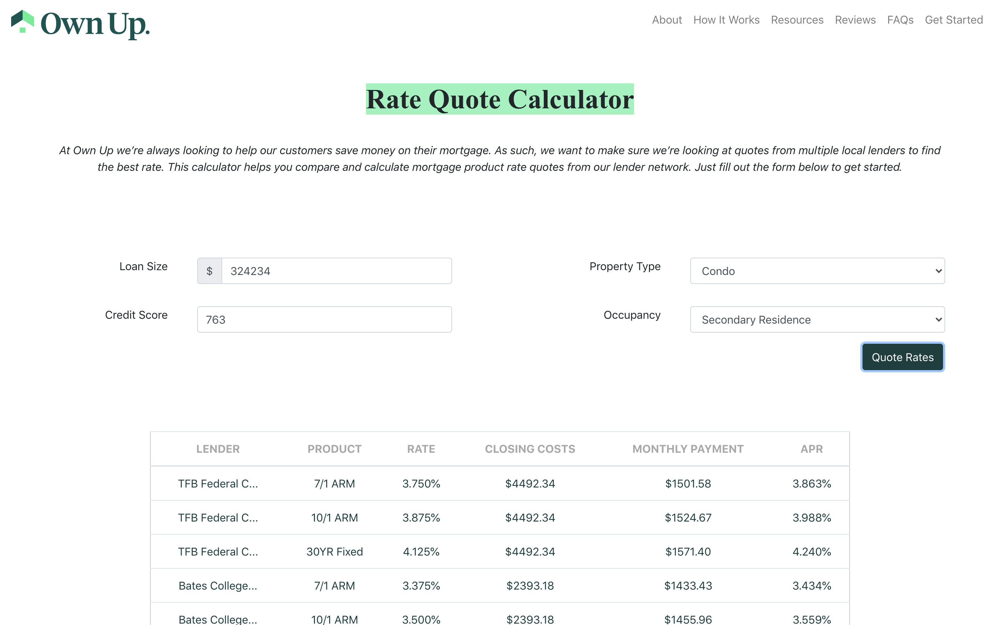

# Rate Quote Coding Challenge for Own Up

This project was created for [Own Up](ownup.com)'s coding challenge. The goal was to create a UI to show users (people looking for home loans) quotes from multiple lenders using data from Own Up's API based on a user's custom information, such as loan amount and credit score. 

---

### Technologies Used

* [Create React App](https://github.com/facebook/create-react-app/tree/master) for UI
* [React-Bootstrap](https://react-bootstrap.github.io/) for responsive UI and grid layout
* [Redux Thunk](https://github.com/reduxjs/redux-thunk) and [React-Redux](https://react-redux.js.org/) for state management 
* Own Up's Rate Quote API
* [Fetch](https://developer.mozilla.org/en-US/docs/Web/API/Fetch_API) for calling and interacting with the API
* [Dot Env](https://www.npmjs.com/package/dotenv) for hiding the API key in committed code
* [Jest](https://jestjs.io/), [React Test Renderer](https://reactjs.org/docs/test-renderer.html) and [Enzyme](https://enzymejs.github.io/enzyme/) for testing 

### How to Run
##### Downloading and running the code
1. Open terminal and run `git clone https://github.com/lilyhlou/own-up.git` or open with Github Desktop/download a zip file of the code.
2. `cd` to open folder (own-up)
3. Run `npm install` to download dependencies (make sure [npm and Node.js](https://docs.npmjs.com/downloading-and-installing-node-js-and-npm) are also installed)
4. Create a .env file in the root (same level as .env.schema) and add the line "REACT_APP_API_KEY= YOUR_API_KEY" (replace 'YOUR_API_KEY' with your API key)
5. Run `npm start` in terminal
6. Insert / select values in text boxes (all fields must be filled to render successfully; values for credit score must be between 300 and 800 and cannot contain non-zero decimals). Click 'Quote Rates' to see a returned table of rates and lenders or an alert if the request was unsuccessful.

##### Running different scripts 
* `npm start` to run the app in development mode.
Open [http://localhost:3000](http://localhost:3000) in you browser. The page will reload if you make edits (note: terminate app with "control + c" and run `npm start` again if API key is updated in .env file).
Press option + command + c and click the console tab of inspector to see errors or to inspect code.

* `npm test` (+ press 'a' if necessary) to run all tests. (Do this at step 5 of the above in place of `npm start` and ensure that API key is added to a .env file before running to pass all Input and Form tests)

* `npm run build` builds the app for production / deployment. Follow the steps in terminal to deploy. (Do this at step 5 of the above in place of `npm start`)

 #### Tests
 * `App.test.js`: snapshot test of App.js and test for App.js rendering without crashing
 * `Input.test.js`: snapshot test of input screen, checking validate methods for various inputs and to see if fetchData (the method sending a GET request to Own Up's API) is called
 * `Form.test.js`: snapshot test of table, tests for returned html depending on props (items, itemsHasErrored, itemsIsLoading)

 #### Potential Future Features
 * Other possible add-ons include sorting (high to low, alphabetical, etc) for table columns, visualizations to compare and interact with different aspects of the table, links to lender sites, pop-up for next steps after finding out the best rate
